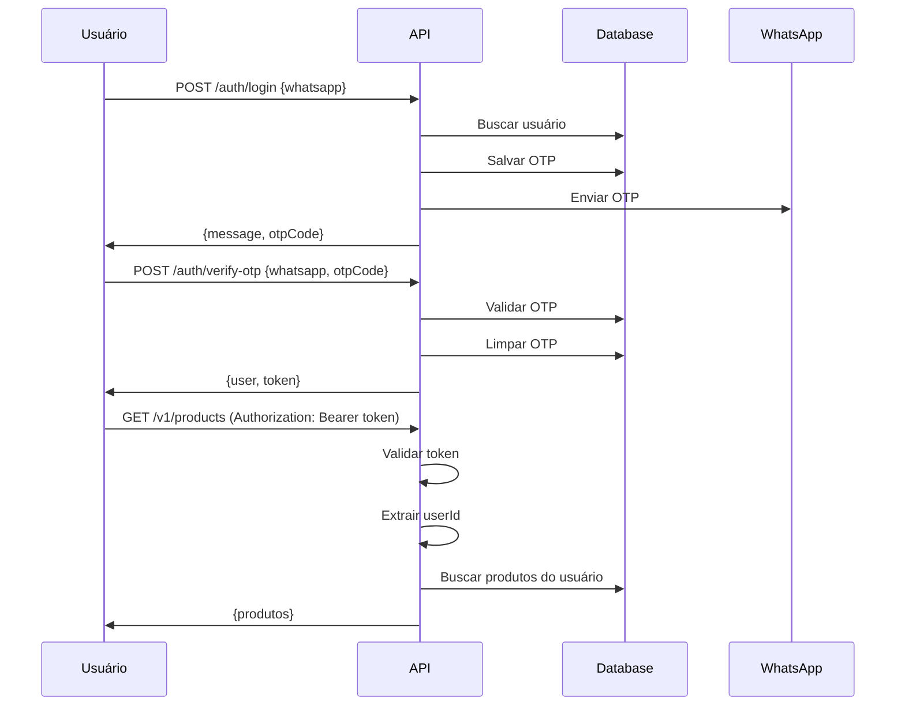

# Módulo de Autenticação

## Sistema de Segurança com WhatsApp + OTP

O sistema de autenticação utiliza WhatsApp como identificador único e OTP (One-Time Password) para validação de segurança.

### Como Funciona

1. **Login**: Usuário informa WhatsApp
2. **OTP**: Sistema gera código de 6 dígitos e envia via WhatsApp
3. **Verificação**: Usuário informa OTP para validar
4. **Token**: Sistema retorna token JWT para autenticação
5. **Acesso**: Token é usado em todas as requisições autenticadas

### Endpoints de Autenticação

#### 1. Login (Solicitar OTP)
```http
POST /auth/login
Content-Type: application/json

{
  "whatsapp": "+5511999999999"
}
```

**Resposta:**
```json
{
  "message": "OTP enviado com sucesso",
  "whatsapp": "+5511999999999",
  "otpCode": "123456" // Apenas em desenvolvimento
}
```

#### 2. Verificar OTP
```http
POST /auth/verify-otp
Content-Type: application/json

{
  "whatsapp": "+5511999999999",
  "otpCode": "123456"
}
```

**Resposta:**
```json
{
  "user": {
    "id": "uuid-do-usuario",
    "name": "Nome do Usuário",
    "whatsapp": "+5511999999999",
    "plan": {
      "id": "uuid-do-plano",
      "name": "Plano Básico"
    },
    "segment": {
      "id": "uuid-do-segmento",
      "name": "Consultora"
    },
    "companies": [
      {
        "id": "uuid-user-company",
        "role": "CONSULTORA",
        "company": {
          "id": "uuid-da-empresa",
          "name": "Empresa XYZ"
        }
      }
    ]
  },
  "token": "eyJhbGciOiJIUzI1NiIsInR5cCI6IkpXVCJ9...",
  "message": "Login realizado com sucesso"
}
```

#### 3. Perfil do Usuário
```http
GET /auth/me
Authorization: Bearer <token>
```

**Resposta:**
```json
{
  "user": {
    "id": "uuid-do-usuario",
    "name": "Nome do Usuário",
    "whatsapp": "+5511999999999",
    "plan": { "id": "uuid", "name": "Plano Básico" },
    "segment": { "id": "uuid", "name": "Consultora" },
    "companies": [...]
  }
}
```

#### 4. Logout
```http
POST /auth/logout
Authorization: Bearer <token>
```

**Resposta:**
```json
{
  "message": "Logout realizado com sucesso"
}
```

### Uso em Outros Endpoints

Todos os endpoints protegidos agora usam autenticação JWT:

```http
GET /v1/products
Authorization: Bearer <token>

GET /clients
Authorization: Bearer <token>

GET /sales
Authorization: Bearer <token>
```

### Segurança Implementada

#### 1. **Geração de OTP**
- Código de 6 dígitos aleatório
- Salvo no banco de dados
- Limpo após verificação bem-sucedida

#### 2. **Validação de Token**
- Token JWT simples (Base64)
- Validação automática em todos os endpoints protegidos
- Extração automática do usuário via `@CurrentUser()`

#### 3. **Isolamento de Dados**
- Cada usuário só acessa seus próprios dados
- Filtros automáticos por `userId`
- Validação de permissões em todas as operações

#### 4. **Guards e Decorators**
- `@UseGuards(AuthGuard)`: Protege endpoints
- `@CurrentUser()`: Extrai usuário autenticado
- Validação automática de token

### Fluxo Completo



### Configuração de Ambiente

```env
NODE_ENV=development # Para mostrar OTP no console
JWT_SECRET=sua-chave-secreta # Para produção
```

### Próximos Passos

1. **Integração WhatsApp**: Implementar envio real de OTP
2. **JWT Real**: Substituir token simples por JWT real
3. **Refresh Token**: Implementar renovação de token
4. **Rate Limiting**: Limitar tentativas de login
5. **Logs de Segurança**: Registrar tentativas de acesso
